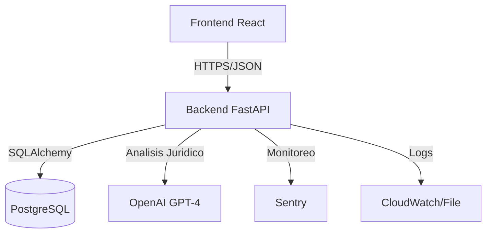

# Arquitectura del Sistema - CivilProtect

## Diagrama de Alto Nivel

## Componentes

### 1. Frontend
- **Tecnología**: React, TailwindCSS.
- **Estado**: Context API (`AuthContext`, `AnalysisContext`).
- **Navegación**: Lazy Loading de componentes grandes.
- **Optimización**: Code Splitting, PWA capabilities.

### 2. Backend
- **Tecnología**: FastAPI.
- **ORM**: SQLAlchemy (Sync/Async patterns).
- **Seguridad**: JWT (OAuth2 flow), Security Headers, Rate Limiting (SlowAPI).
- **Logging**: JSON Structured logs, Sentry integration.

### 3. Servicios Específicos
- **Calculator Engine**: Lógica determinista de cálculo de riesgos (Extintores, Aforo).
- **AI Service**: Enriquecimiento legal mediante LLMs.
- **Report Generator**: Creación de PDFs con `reportlab`.
- **Legislative Monitor**: Bot en background para revisar actualizaciones en el DOF.
